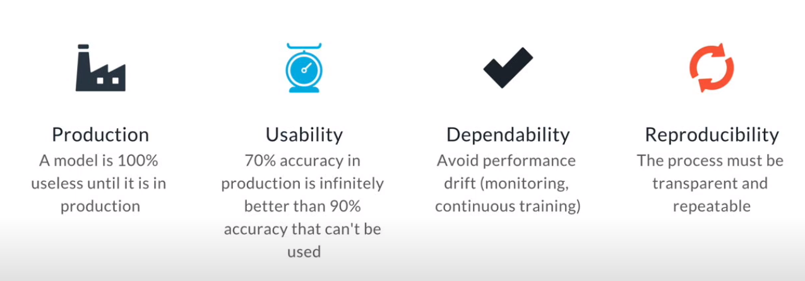
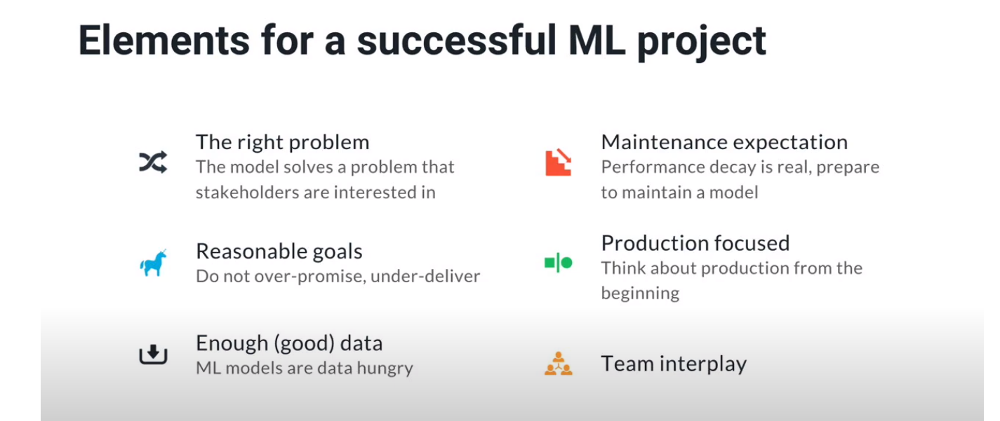
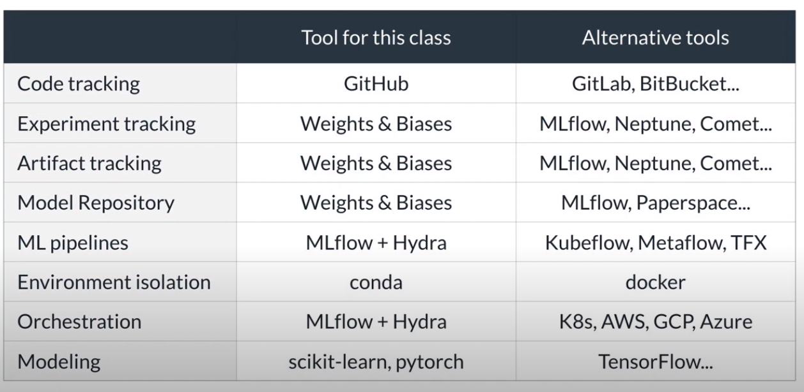
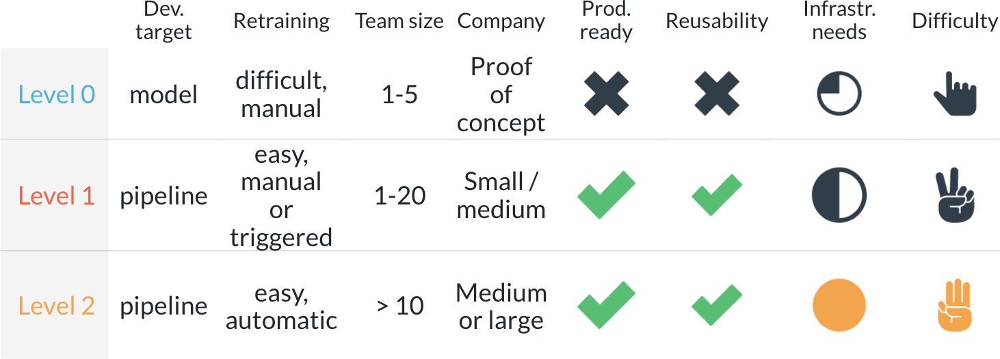

# Machine Learning DevOps Engineer

In this program, I've built some DevOps skills required to automate various aspects and stages of the machine learning lifecycle. The course consists in four modules:

* Clean Code Principles
    - Project: Predict customer churn with clean code
* Building a Reproducible Model Workflow
    - Project: Build an ML pipeline for short-term rental prices in NYC
* Deploying a Scalabel ML Pipeline in Production
    - Project: Deploying a machine learning model on Heroku
* Automated model scoring and monitoring
    - Project: A dynamic risk assessment system

## Concepts and tools learned:

* Clean code concepts and practices
* MLOps concepts and practices
* MLOps levels
* PEP8 compliant documentation
* Unit testing
* Pytest
* Pylint
* Autopep8
* MLflow
* Weights and Biases
* Hydra

## Interesting quotes and images

> "MLOPs is a set of best practices and methods for an **efficient** end-to-end development and operation of **performant, scalable, reliable, automated** and **reproducible** ML solutions in a real **production** setting."

